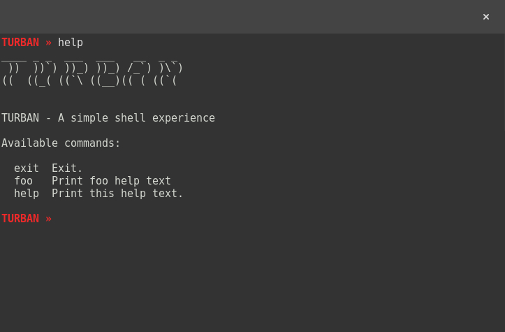

# Turban Shell

[](https://godoc.org/github.com/desertbit/turban)
[](https://goreportcard.com/report/github.com/desertbit/turban)

A simple shell experience.



## Sample

```go
package main

import (
	"fmt"

	"github.com/desertbit/turban"
)

func main() {
	turban.SetPrompt("TURBAN » ")
	turban.SetHelpHeader("TURBAN - A simple shell experience")
	turban.SetPrintASCIIArtFunc(printASCIIArt)

	turban.AddCommand("foo", &turban.Command{
		Help:  "Print foo help text",
		Usage: "foo [BAR]",
		Run: func(args []string) error {
			// ...
			return nil
		},
	})

	turban.Run(true)
}

func printASCIIArt() {
	fmt.Println("____ _ _  ___  ___   __  _ _ ")
	fmt.Println(" ))  ))`) ))_) ))_) /_`) )\\`)")
	fmt.Println("((  ((_( ((`\\ ((__)(( ( ((`( ")
	fmt.Println("")
}
```
